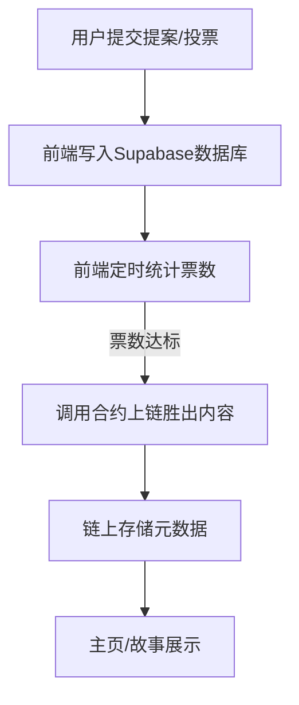

# NarrFlow - 协作叙事平台

NarrFlow 是一个基于区块链技术的去中心化协作小说创作平台，允许用户共同创作故事并获得代币奖励。平台支持故事创建、段落添加、投票决策，结合了创作自由与社区共识机制。

## 现行方案说明
- 所有投票行为和票数统计均在前端通过数据库（Supabase）进行。
- 前端定时统计票数，一旦某个提案票数达到阈值，自动将该内容通过合约写入链上。
- 链上只存储最终胜出的内容元数据（如内容哈希、作者等），不再存储所有投票细节。
- 正文内容链下存储，链上仅存元数据。

## 功能特性
- **协作创作**：多人参与故事创作，共同决定情节发展
- **投票机制**：社区投票选出最佳段落提案，确保高质量内容
- **代币奖励**：创作者和参与者可获得NARR代币奖励
- **链上治理**：投票和决策透明，永久记录在区块链上
- **移动友好**：响应式设计，支持多端访问
- **多语言支持**：内置中英文界面切换

## 技术栈
### 前端技术
- React 18 + TypeScript
- TailwindCSS + CSS Modules
- Framer Motion、GSAP、React Spring
- Redux Toolkit
- Vite
- Supabase（数据库）

### 区块链技术
- 智能合约：Move on Sui
- Web3交互：@suiet/wallet-kit
- 钱包连接：Sui Wallet

## 智能合约模块
- **story.move** - 故事与段落管理（只存元数据和投票结果）
- **token.move** - 代币和奖励系统
- **narr_flow.move** - 核心业务逻辑模块

## 存储策略
- 链上存储：故事元数据、投票结果、用户奖励
- 数据库存储：所有提案、投票、票数统计
- 正文内容链下存储（如对象存储、数据库等）

## 项目逻辑流程图


## 安装与使用

### 前端
```bash
# 克隆仓库
git clone https://github.com/DudeGuuud/NarrFlow-Web3.git
cd NarrFlow-Web3

# 安装依赖
pnpm install

# 启动开发服务器
pnpm run dev

# 构建生产版本
pnpm run build
```

根目录添加.env并填写
```bash
VITE_PACKAGE_ID=
VITE_STORYBOOK_ID=
VITE_TREASURY_ID=
VITE_SUI_NETWORK=testnet

数据库

VITE_SUPABASE_URL=
VITE_SUPABASE_KEY=

执行sql语句
create table if not exists proposals (
  id bigserial primary key,
  content text not null,
  author text not null,
  votes integer not null default 0,
  type text not null,
  created_at timestamptz not null default now()
);

create table if not exists votes (
  id bigserial primary key,
  proposal_id bigint not null references proposals(id) on delete cascade,
  voter text not null,
  created_at timestamptz not null default now()
);


# 后续添加 Walrus 相关 endpoint
# VITE_WALRUS_PUBLISHER=
# VITE_WALRUS_AGGREGATOR=
```

### 智能合约
```bash
# 切换到合约目录
cd move

# 编译合约
sui move build

# 部署合约
sui client publish
```

## 贡献
欢迎贡献代码、报告问题或提出改进建议。请先fork本仓库，创建功能分支，然后提交PR。

## 许可证
本项目采用 [MIT 许可证](LICENSE)。 
