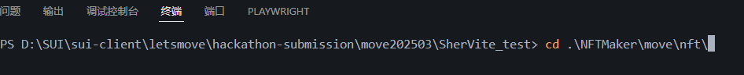

项目测试：
1.sui move build &publish;   
2.npm install; 
3.pnpm build ; pnpm preview  

综合介绍：

目前参与黑客松的项目：无代码NFT工具模版

项目简介
无代码NFT工具模版项目，就是创建一个可供用户根据自定义功能随时调取合约模版的框架，用于快速搭建合约与前端逻辑模块
计划包含个人NFT展示，一键铸造，批量铸造，NFT资产打包，以及多模块同时调取组合等。
目前只完成，钱包自动链接，一键铸造，转移铸造功能。

工程结构
基于官方提供的dapp-kit脚手架写的：
1.铸造转移合约；
2.创建NFT组件，展示组件（未完成）。

参与人
Aaron 
GitHub ID：SherVite
编程基础：Python
一名表面渴望平静生活而内心热衷新生事物的上班族，理想与现实主义者。
关注web3与现实生活紧密的结合点，学习以SUI为核心的web3生态领域，未来关注资产线上下购物，物流等运用场景。也很喜欢DeSCI等概念。喜欢结实小伙伴共同进步学习。