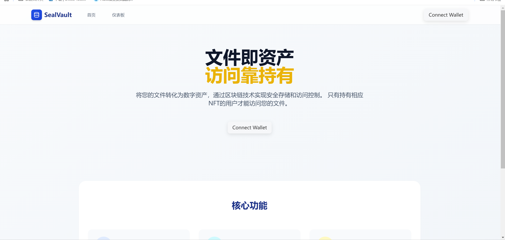
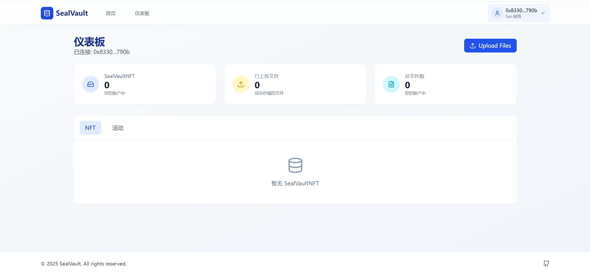

# 🛡️ SealVault

> [中文文档](README.zh-CN.md) | [English](README.md)

**SealVault** is a decentralized file access control system built on the **Sui blockchain**, combining the [**Walrus**](https://github.com/MystenLabs/walrus) decentralized file storage protocol with the [**Seal**](https://github.com/MystenLabs/seal) encryption key management framework.

The core concept of SealVault is: **File access rights = NFT ownership**. When users upload files, the system automatically generates access NFTs. Only accounts holding these NFTs can access the corresponding files, implementing a true Web3-style "asset as permission" model.

---

## ✨ Features

- 📤 **File Upload**: Files are encrypted and stored on Walrus.
- 🔐 **Access Control**: Seal verifies access requests, ensuring only NFT holders can access files.
- 🧬 **Access NFTs**: Files are bound to unique NFTs, transferring access rights with NFT transfers.
- 🔄 **On-chain Verification**: All access permission checks are implemented in Move contracts, ensuring security and transparency.

---

## 🧱 Tech Stack

| Layer         | Technologies Used                          |
|---------------|--------------------------------------------|
| Smart Contract| Move (based on Sui blockchain)             |
| File Storage  | [Walrus](https://github.com/MystenLabs/walrus) |
| Key Management| [Seal](https://github.com/MystenLabs/seal)     |
| Frontend      | React + Tailwind CSS + Vite                |
| Wallet        | Sui Wallet                                 |

---

## 📁 Project Structure

```
SealVault/
├── sealvault/             # Move contract modules: access control logic
├── SealVault-Frontend/    # Frontend: user interaction and contract calls
├── docs/                  # Documentation and screenshots (optional)
└── README.md              # This file
```

---

## 🚀 Quick Start

### 📦 Deploy Move Contracts

```bash
cd sealvault
sui move build
```

> ✅ After compilation, deploy to devnet or local chain, note the Package ID for frontend calls.

---

### 💻 Start Frontend Project

```bash
cd SealVault-Frontend
npm install
npm run dev
```

> Visit `http://localhost:5173` in your browser to view the frontend interface. (Please note that you need to set up environment variables in the `.env` file under the SealVault-Frontend folder according to your needs)

---

## 🔐 Seal & Walrus Introduction

### 🦭 🐘 Walrus: Decentralized Encrypted Storage Protocol

- Supports file encryption, sharding, and distributed storage.
- Each file corresponds to a unique `blob_id` for subsequent verification.

### 🦭 Seal: Key Service and Access Control Framework

- Before accessing files, Seal calls the `seal_approve` function in Move contracts to verify permissions.
- Only users holding the corresponding `FileAccessNFT` will have their access requests approved.

SealVault binds **NFT ownership** with **encrypted access rights**, truly implementing "only you can open what you upload".

---

## 🖼️ Example Interfaces





---

## 📜 License

This project is licensed under the **GNU General Public License v3.0 (GPL-3.0)**:

- ✅ Free to use, learn, modify, and redistribute.
- ❗ Modified projects must also be open-sourced under GPL-3.0.

See [LICENSE](./LICENSE) file for details.

---

## 🙌 Acknowledgments

This project draws inspiration and capabilities from:

- [Sui](https://github.com/MystenLabs/sui)
- [Seal](https://github.com/MystenLabs/seal)
- [Walrus](https://github.com/MystenLabs/walrus)

Welcome to contribute and collaborate, let's build a secure and open Web3 file management ecosystem together!

---
